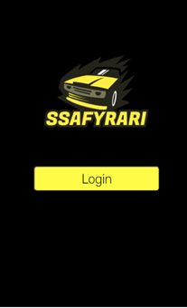

# 🚖 싸삐라리


## ✨ 프로젝트 소개

```
Morai 시뮬레이터상에서 ROS기반 자율주행 구현 및 공유택시 모바일 웹 서비스 개발
```

## 🙂 기획 배경

```
 - 기존 운행중인 자율주행 서비스에 대한 단점을 극복하고자 개발
현재 5 ~ 50km정도의 자율주행 구역으로인해 서비스가 버스와 셔틀로 한정되어있음.
이를 개선하여 싸삐라리는 상암일대 전 지역 서비스가 가능하여 공유 택시 서비스로 확장
```

## 😎 서비스 기능

1. 출발지 위치 설정
2. 도착지 위치 설정
3. 택시 호출
4. 택시 위치 확인
5. MORAI상에서 택시 자율주행

## 👀 Overview

### 1. 로그인 전



### 2. 로그인 후


### 3. 택시 호출


### 4. 공유택시호출


### 5. 출발지 설정


### 6. 도착지 검색


### 7. 도착지 선택


### 8. 택시 매칭중


### 9. 택시 운행중


## 🦄 기대효과 & 발전방향

- 공유택시 금액절감
- 교통 정체, 완화
- 고령자 이동 지원
- 운전 피로도 감소
- 교통사고 저감

## 💻 Tech Stack


### 시스템 아키텍처


## Backend( VM-Ubuntu18.04 )

```
Python 2.7
ROS melodic

```

### Frontend

```
$ cd FrontEnd/ssafyrari
$ npm install
$ npm start

```

## 🤼‍♂️ Author

Team Leader & 자율주행: 🐯김지호

자율주행 (인지, 판단): 🐱 고현영

자율주행 (판단, 제어): 🐶 백현웅

자율주행(판단) & WEB: 🐺 박상현

자율주행 (판단, 제어) : 🐱 지이주

자율주행(인지, 제어) : 🦁 양영진
